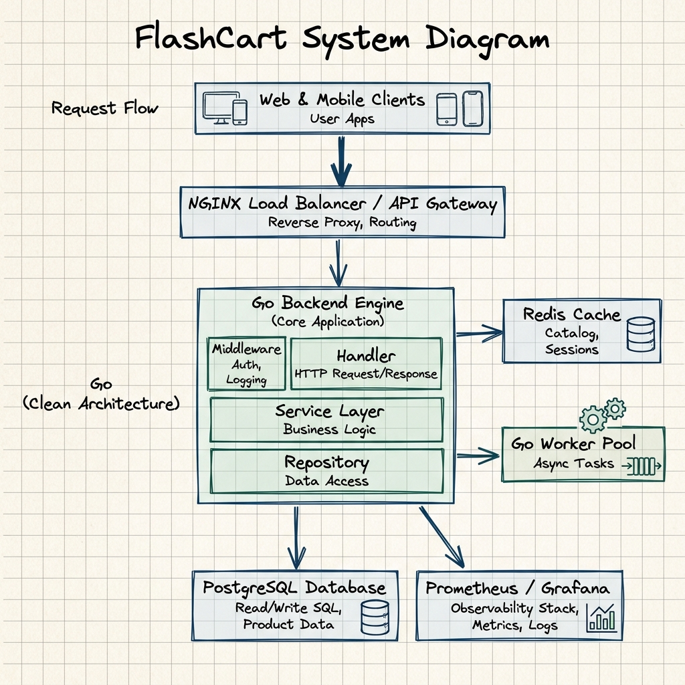
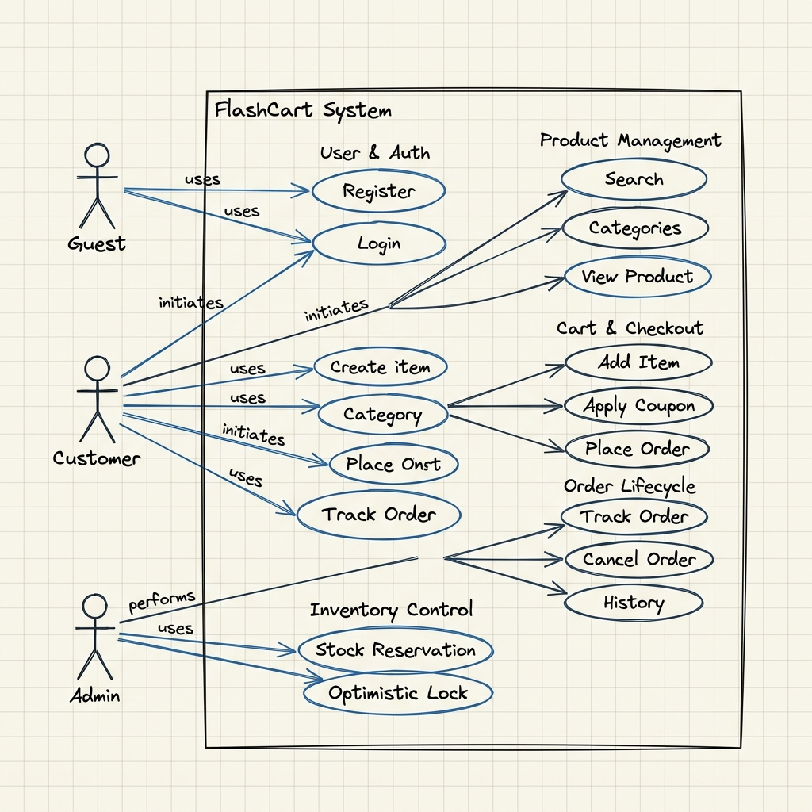
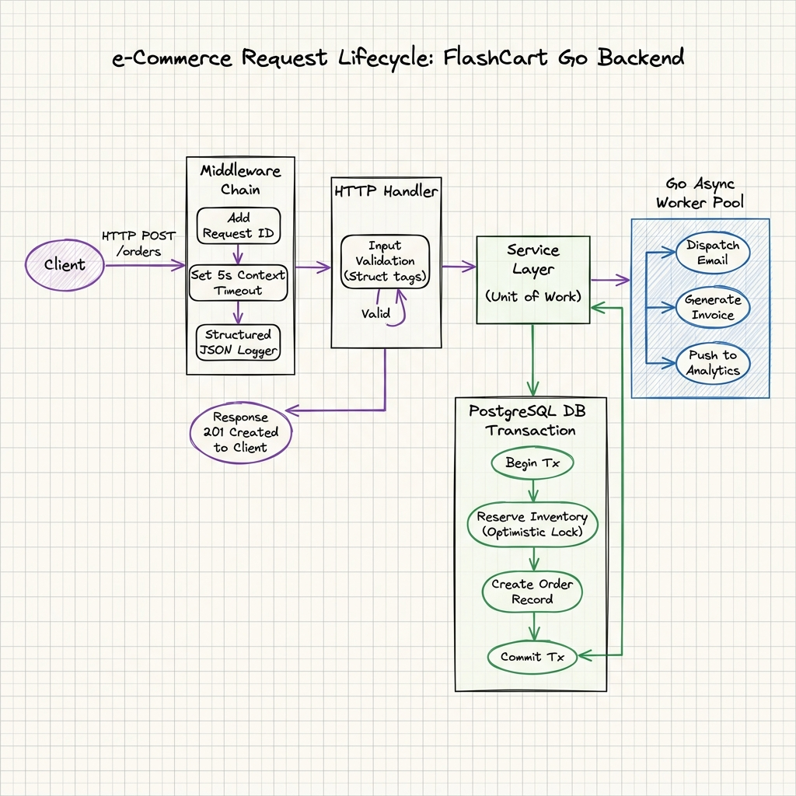
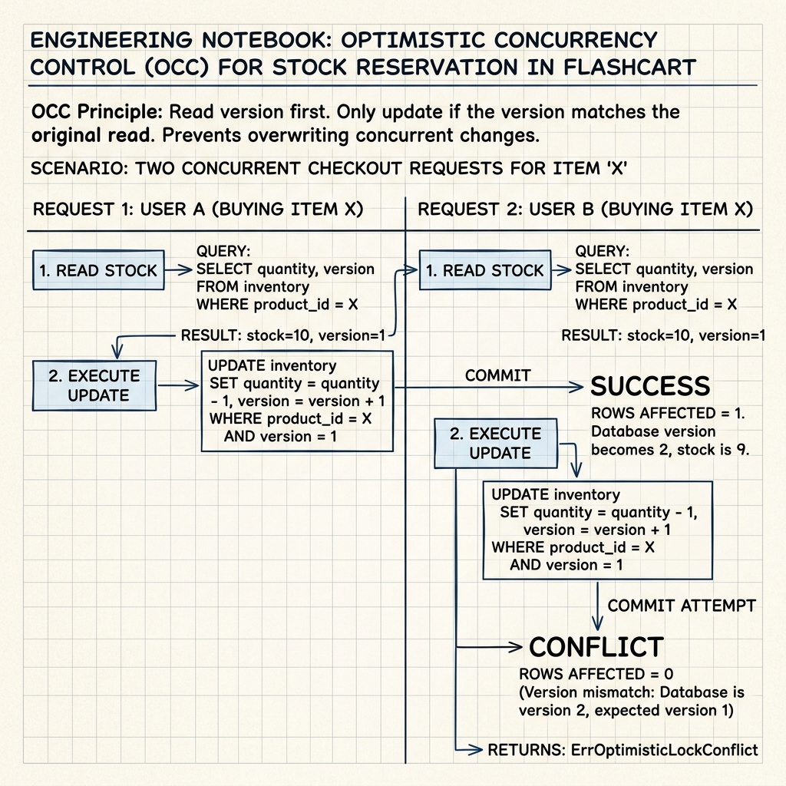
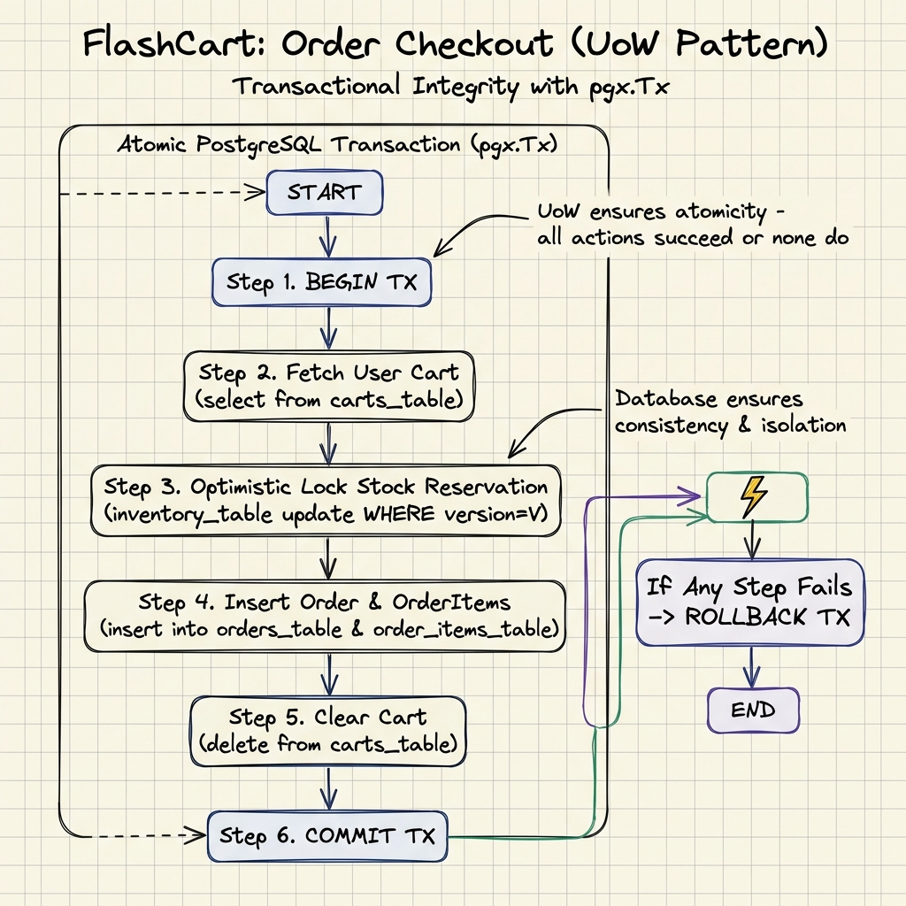
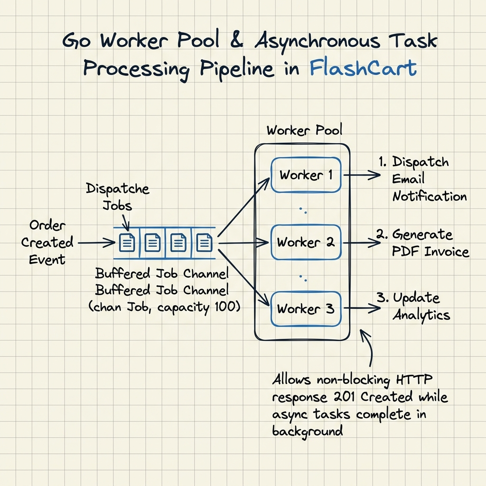

# 🚀 FlashCart - Production Engineering Laboratory

> **High-Performance, Production-Grade E-Commerce Backend written in Go, implementing Clean Architecture, Domain-Driven Design (DDD), Optimistic Concurrency Locking, Unit of Work Transactions, and Event-Driven Asynchronous Processing.**

[](https://golang.org/)
[](#-1-system-architecture-block-diagram)
[](LICENSE)

---

## 💡 Overview & Engineering Objectives

FlashCart is a **production-grade backend system** engineered to demonstrate top-tier software engineering standards (Google / Uber / Atlassian / Rubrik level). Rather than building basic CRUD handlers, FlashCart serves as an **engineering laboratory** designed to solve real-world system design challenges: high-concurrency race conditions, atomic database transactions, zero-panic middleware pipelines, observable metrics, and non-blocking background task processing.

### Core Engineering Principles
- **Clean Architecture & DDD**: Strict isolation between HTTP transport handlers, domain business services, and database persistence layers.
- **Optimistic Concurrency Control**: Stock reservations executed with versioned database locks (`WHERE product_id = $1 AND version = $2`), preventing race conditions during flash sales.
- **Transactional Unit of Work**: Multi-table order processing executed inside atomic PostgreSQL transactions (`pgx.Tx`), ensuring zero partial writes.
- **Fault-Tolerant Middleware Pipeline**: Request ID propagation, panic safety recovery, and strict 5-second context timeout boundaries.
- **Zero-Allocation Observability**: High-throughput structured JSON logging using Go standard `log/slog`.

---

## 📐 1. System Architecture Block Diagram

Our backend architecture separates concerns across isolated architectural layers: Client → NGINX Load Balancer / API Gateway → HTTP Middleware Chain → Service Layer → Data Repositories → PostgreSQL & Redis Cache.



---

## 🎯 2. Use Case Diagram

Detailed functional decomposition of FlashCart actors and domain capabilities across Auth, Catalog, Cart, Orders, and Stock Reservations.



---

## 🔄 3. Chronological Request Operations Trace (Sequence)

How incoming requests execute through FlashCart's zero-panic middleware pipeline, transactional Unit of Work database locks, and background async worker pools.



```text
Client (HTTP POST /orders)
  │
  ├──► [ Middleware Layer ]
  │      ├── Request ID Generator (X-Request-ID)
  │      ├── Recovery Handler (Panic Safety)
  │      ├── Timeout Context (5s Deadline)
  │      └── Structured Logger (slog JSON)
  │
  ├──► [ HTTP Handler & Service Layer ]
  │      ├── Input Validation & DTO Decoding
  │      └── Business Domain Rules Execution
  │
  ├──► [ Data Layer - PostgreSQL DB Transaction ]
  │      ├── BEGIN TX (pgxpool)
  │      ├── Reserve Inventory (Optimistic Locking: WHERE version = x)
  │      ├── Create Order Entity
  │      └── COMMIT TX
  │
  ├──► [ Async Worker Pool ]
  │      ├── Dispatch Notification / Email
  │      └── Trigger Analytics & Invoice Jobs
  │
  └──► HTTP 201 Created Response
```

---

## 📝 4. Engineering Deep-Dives & Handwritten Notes

### A. Optimistic Concurrency Control & Stock Locking

In high-concurrency e-commerce systems, thousands of checkout requests attempt to reserve stock for popular items simultaneously. Traditional pessimistic locking (`SELECT FOR UPDATE`) causes database connection starvation and query deadlocks. 

FlashCart implements **Optimistic Concurrency Control (OCC)** using explicit version checks:



#### Implementation Pattern (`internal/inventory/repository_pg.go`):
```sql
UPDATE inventory
SET quantity = quantity - $1, version = version + 1, updated_at = NOW()
WHERE product_id = $2 
  AND version = $3 
  AND (quantity - reserved_quantity) >= $1;
```
If `commandTag.RowsAffected() == 0`, the transaction detects a version conflict or insufficient stock and returns `ErrOptimisticLockConflict` without locking table rows.

---

### B. Transactional Unit of Work Order Checkout

Processing an order requires mutating multiple tables (inventory stock, orders, order line items, and cart state). If a failure occurs midway (e.g. invalid payment or network glitch), the system must never leave orphan orders or unreserved inventory.

FlashCart implements the **Unit of Work Pattern** wrapping execution inside an atomic PostgreSQL transaction:



#### Execution Lifecycle (`internal/order/service.go`):
1. `tx, err := db.Pool.Begin(ctx)`
2. Read shopping cart items
3. Reserve inventory stock using **Optimistic Locking**
4. Insert Order and OrderItems records
5. Clear user shopping cart
6. `tx.Commit(ctx)` — If any step fails, `tx.Rollback(ctx)` executes automatically.

---

### C. Asynchronous Worker Pool & Event Pipeline

Synchronous HTTP handlers should never execute long-running tasks like rendering PDF invoices, sending emails, or pushing analytics events. Doing so inflates API response latency.

FlashCart decouples execution using a **Go Goroutine Worker Pool**:



#### Workflow:
- The HTTP handler dispatches an `OrderCreated` event to a buffered channel (`chan Job`, capacity 100).
- A pool of parallel worker goroutines pulls jobs from the channel concurrently.
- The client receives an immediate `201 Created` response while worker goroutines process notifications in the background.

---

## 🛠 5. Tech Stack

- **Language & Runtime**: Go 1.24+ (Standard Library, `net/http`)
- **Database**: PostgreSQL 16 (`jackc/pgx/v5` connection pooling via `pgxpool`)
- **Cache**: Redis 7 (`redis/go-redis/v9`)
- **Security**: JWT (`golang-jwt/jwt/v5`), Bcrypt password hashing (`golang.org/x/crypto`)
- **Containerization & Dev Tooling**: Docker, Docker Compose, Makefile
- **DevOps**: GitHub Actions CI/CD Pipeline
- **Observability**: Prometheus (`/metrics`), Grafana, OpenTelemetry, `slog` JSON Logging

---

## 📂 6. Clean Architecture Directory Structure

```text
flashcart/
├── cmd/
│   └── server/
│       └── main.go                 # App bootstrap & Graceful Shutdown listener
├── internal/
│   ├── config/config.go            # Environment configuration & timeout controls
│   ├── logger/logger.go            # Structured JSON logger with Context Trace IDs
│   ├── database/                   # PostgreSQL connection pool & schema migrations
│   │   ├── postgres.go
│   │   └── migrations.go
│   ├── cache/redis.go              # Redis cache connection manager
│   ├── response/response.go        # Standardized HTTP JSON API responses
│   ├── middleware/middleware.go    # Request ID, Recovery, Logger, Timeout, CORS
│   ├── server/
│   │   ├── server.go               # HTTP server setup & domain route wiring
│   │   └── health.go               # Health, Liveness, and Readiness probes
│   ├── domain/                     # Core enterprise domain entities & interfaces
│   │   ├── user.go
│   │   ├── product.go
│   │   ├── inventory.go
│   │   ├── cart.go
│   │   └── order.go
│   ├── auth/                       # JWT Authentication, Bcrypt, & RBAC Middleware
│   ├── user/                       # User profile persistence
│   ├── product/                    # Product catalog & Redis cache decorator
│   ├── inventory/                  # Inventory optimistic locking stock manager
│   ├── cart/                       # Redis shopping cart persistence
│   ├── order/                      # Order checkout engine & Unit of Work transactions
│   ├── payment/                    # Payment gateway integration skeleton
│   ├── shipping/                   # Logistics & shipment tracking skeleton
│   └── notification/               # Asynchronous task notification skeleton
├── scripts/
│   └── migrations/                 # DDL SQL Schema Migration Scripts
├── docs/
│   └── architecture/               # Excalidraw architecture & engineering note diagrams
├── docker-compose.yml              # Local container environment (PostgreSQL + Redis + App)
├── Dockerfile                      # Multi-stage production container build
├── Makefile                        # Automation commands
├── .env.example                    # Environment variable template
└── go.mod
```

---

## ⚡ 7. Local Development & Setup

### Prerequisites
- Go 1.24+ installed
- Docker & Docker Compose (Optional for local PostgreSQL and Redis containers)

### Quick Start

1. **Clone the Repository**
   ```bash
   git clone https://github.com/varun-2122/flashcart.git
   cd flashcart
   ```

2. **Configure Environment Variables**
   ```bash
   cp .env.example .env
   ```

3. **Start Storage Services (PostgreSQL & Redis)**
   ```bash
   # Using Docker Compose
   make docker-up
   ```

4. **Run the Backend Engine**
   ```bash
   make run
   ```

5. **Execute Unit Test Suite**
   ```bash
   make test
   ```

---

## 🚦 8. Engineering Phase Roadmap

| Phase | Description | Status |
|---|---|---|
| **Phase 1** | Core Infrastructure Foundation (Clean Architecture, Config, Structured `slog` Logger, Postgres `pgxpool`, Redis Client, Health Probes, Graceful Teardown, Docker Compose) | ✅ **Completed** |
| **Phase 2** | Domain Engineering & Core Modules (JWT Auth, Refresh Tokens, Product Catalog, Inventory Optimistic Locking, Cart, Order DB Transactions) | ✅ **Completed** |
| **Phase 3** | Concurrency Engine & Business Observability (Go Worker Pools, Prometheus `/metrics`, Grafana Business Dashboard) | ⏳ **Next** |
| **Phase 4** | Production Observability & Cloud Native (OpenTelemetry Tracing, GitHub Actions CI/CD Pipeline, Kubernetes & Helm Deployment) | 🔜 Planned |

---

## 📊 9. Endpoints & API Reference

### System & Health Probes

| Endpoint | Method | Description | Success Response | Status |
|---|---|---|---|---|
| `/` | `GET` | API Engine Information | `{"name":"FlashCart API Engine","version":"v2.0.0","status":"operational"}` | `200 OK` |
| `/healthz` | `GET` | System Liveness Probe | `{"success":true,"data":{"status":"UP"}}` | `200 OK` |
| `/livez` | `GET` | Kubernetes Liveness Probe | `{"success":true,"data":{"status":"ALIVE"}}` | `200 OK` |
| `/readyz` | `GET` | Deep Readiness Probe (DB + Redis) | `{"status":"READY","database":"UP","cache":"UP"}` | `200 OK` / `503 Service Unavailable` |

### Auth API

| Endpoint | Method | Auth | Description | Payload / Query |
|---|---|---|---|---|
| `/api/v1/auth/register` | `POST` | None | Register new user account | `{"email", "password", "first_name", "last_name", "role"}` |
| `/api/v1/auth/login` | `POST` | None | Authenticate and obtain JWT | `{"email", "password"}` |

### Product Catalog API

| Endpoint | Method | Auth | Description | Payload / Query |
|---|---|---|---|---|
| `/api/v1/products` | `GET` | None | List catalog with pagination & search | `?search=...&category_id=...&min_price=...&limit=20&offset=0` |
| `/api/v1/products/{id}` | `GET` | None | Get product by UUID (Redis cached) | Path Param `{id}` |
| `/api/v1/products` | `POST` | Admin | Create product & initial stock | `{"sku", "name", "price", "brand", "quantity"}` |

### Shopping Cart & Order API

| Endpoint | Method | Auth | Description | Payload / Query |
|---|---|---|---|---|
| `/api/v1/cart` | `GET` | Bearer JWT | View user shopping cart | Header `Authorization: Bearer <token>` |
| `/api/v1/cart/items` | `POST` | Bearer JWT | Add item to cart | `{"product_id", "quantity"}` |
| `/api/v1/cart/items/{product_id}` | `DELETE` | Bearer JWT | Remove item from cart | Path Param `{product_id}` |
| `/api/v1/orders` | `POST` | Bearer JWT | Process checkout (Unit of Work DB Tx) | Header `Authorization: Bearer <token>` |
| `/api/v1/orders` | `GET` | Bearer JWT | List authenticated user orders | Header `Authorization: Bearer <token>` |

---

## 📜 License

This project is licensed under the MIT License - see the [LICENSE](LICENSE) file for details.
